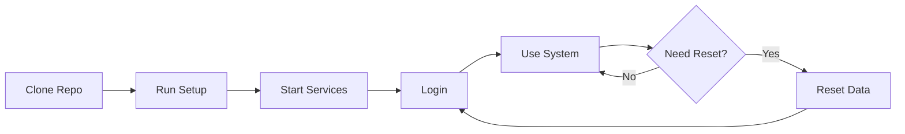

# 🚀 InvoiceRWA - Quick Reference Card

## 📦 One-Line Installation

```powershell
# Windows
git clone https://github.com/danielnguyen161205/InvoiceRWA.git && cd InvoiceRWA && .\quick-setup.ps1

# macOS/Linux
git clone https://github.com/danielnguyen161205/InvoiceRWA.git && cd InvoiceRWA && chmod +x quick-setup.sh && ./quick-setup.sh
```

## ⚡ Quick Commands

| Action | Windows | macOS/Linux |
|--------|---------|-------------|
| **Setup All** | `.\quick-setup.ps1` | `./quick-setup.sh` |
| **Start All** | `.\start-all.ps1` | `./start-all.sh` |
| **Reset Data** | `.\reset-data.ps1` | `./reset-data.sh` |

## 🌐 Default URLs

| Service | URL |
|---------|-----|
| **Frontend** | http://localhost:5500 |
| **API** | http://localhost:8000 |
| **API Docs** | http://localhost:8000/docs |
| **Blockchain** | http://127.0.0.1:8545 |

## 🔐 Default Login

```
Email:    admin@invoicerwa.com
Password: Admin123!
```

## 📂 Project Structure

```
InvoiceRWA/
├── Backend/          → FastAPI + Smart Contracts
├── Frontend/         → HTML/CSS/JS
├── DEPLOYMENT_GUIDE.md → Full setup guide
└── README.md         → Main documentation
```

## 🔧 Manual Start (if scripts don't work)

### Terminal 1 - Backend
```powershell
cd Backend
python -m venv venv
.\venv\Scripts\Activate.ps1  # Windows
source venv/bin/activate      # macOS/Linux
pip install -r requirements.txt
uvicorn app.main:app --reload
```

### Terminal 2 - Blockchain
```powershell
cd Backend/contracts
npm install
npx hardhat node
```

### Terminal 3 - Deploy Contracts
```powershell
cd Backend/contracts
npx hardhat run scripts/deploy.js --network localhost
```

### Terminal 4 - Frontend
```powershell
cd Frontend
npm install
npm run build:css
npm start
```

## 🛠️ Requirements

- **Python** 3.11+
- **Node.js** 20+
- **MySQL** 8.0+ (or use Aiven Cloud)
- **Git**
- **MetaMask** (for Web3)

## 📖 Full Documentation

- **[DEPLOYMENT_GUIDE.md](DEPLOYMENT_GUIDE.md)** - Complete setup guide
- **[README.md](README.md)** - Main documentation
- **[CONTRIBUTING.md](CONTRIBUTING.md)** - Contribution guide

## 🆘 Common Issues

### Port 8000 already in use
```powershell
# Windows
netstat -ano | findstr :8000
taskkill /PID <PID> /F

# macOS/Linux
lsof -ti:8000 | xargs kill -9
```

### Virtual environment not activating
```powershell
# Windows - Enable scripts
Set-ExecutionPolicy -ExecutionPolicy RemoteSigned -Scope CurrentUser
```

### CSS not loading
```powershell
cd Frontend
npm run build:css
# Clear browser cache: Ctrl+Shift+R
```

## 🔄 Quick Reset Database

```powershell
# Windows
.\reset-data.ps1

# macOS/Linux
./reset-data.sh

# Or manual
cd Backend
python clear_data_except_admin.py
```

## 🎯 Workflow



## 📊 Architecture

```
Frontend (5500) → Backend API (8000) → MySQL
                ↓
            Blockchain (8545)
```

## 🚦 Health Check

```bash
# Check Backend
curl http://localhost:8000

# Check Blockchain
curl -X POST http://127.0.0.1:8545 \
  -H "Content-Type: application/json" \
  -d '{"jsonrpc":"2.0","method":"eth_blockNumber","params":[],"id":1}'
```

## 💡 Pro Tips

1. **Always activate venv** before running Python commands
2. **Keep Hardhat node running** in separate terminal
3. **Build CSS** after changing SCSS files
4. **Use API Docs** at /docs for testing
5. **Check console logs** for errors

## 🏆 Key Features

- ✅ KYC/KYB Verification
- ✅ Invoice Tokenization (NFT)
- ✅ Web3 Integration
- ✅ Role-Based Access
- ✅ Document Upload (S3)
- ✅ Smart Contracts (Solidity)

## 📞 Support

- **Issues**: [GitHub Issues](https://github.com/danielnguyen161205/InvoiceRWA/issues)
- **Email**: danielnguyen161205@gmail.com

---

**Version**: 1.0.0 | **Updated**: Jan 11, 2026
