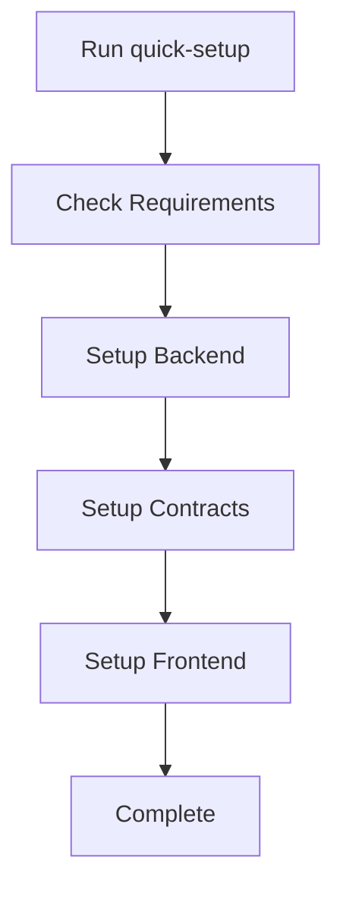
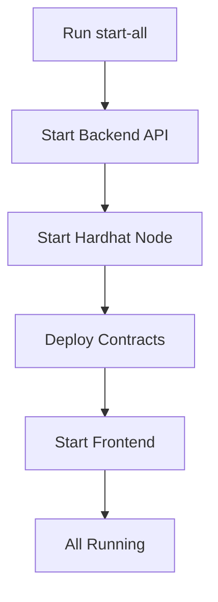
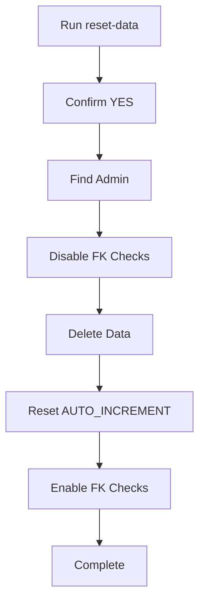

# 📜 Scripts Documentation

Tài liệu về các scripts tự động trong dự án InvoiceRWA.

---

## 🚀 Setup Scripts

### `quick-setup.ps1` (Windows)

**Mô tả**: Cài đặt tự động toàn bộ dự án cho Windows

**Chức năng**:
- ✅ Kiểm tra Python, Node.js, Git
- ✅ Tạo Python virtual environment
- ✅ Cài đặt Backend dependencies
- ✅ Cài đặt Smart Contracts dependencies
- ✅ Compile contracts
- ✅ Cài đặt Frontend dependencies
- ✅ Build CSS

**Sử dụng**:
```powershell
.\quick-setup.ps1
```

**Yêu cầu**:
- PowerShell 5.1+
- Python 3.11+
- Node.js 20+
- Git

---

### `quick-setup.sh` (macOS/Linux)

**Mô tả**: Cài đặt tự động toàn bộ dự án cho macOS/Linux

**Chức năng**: Tương tự `quick-setup.ps1`

**Sử dụng**:
```bash
chmod +x quick-setup.sh
./quick-setup.sh
```

**Yêu cầu**:
- Bash shell
- Python 3.11+
- Node.js 20+
- Git

---

## 🏃 Startup Scripts

### `start-all.ps1` (Windows)

**Mô tả**: Khởi động tất cả services cùng lúc trong các terminal riêng

**Services được khởi động**:
1. **Backend API** (Port 8000)
2. **Hardhat Blockchain** (Port 8545)
3. **Smart Contract Deployment**
4. **Frontend Server** (Port 5500)

**Sử dụng**:
```powershell
.\start-all.ps1
```

**Output**:
- Mở 4 terminal windows riêng biệt
- Mỗi window chạy một service
- Hiển thị URLs và credentials

**Lưu ý**:
- Giữ các terminal mở trong khi sử dụng
- Đóng terminal để stop service tương ứng

---

### `start-all.sh` (macOS/Linux)

**Mô tả**: Khởi động tất cả services sử dụng tmux

**Services được khởi động**: Tương tự `start-all.ps1`

**Sử dụng**:
```bash
chmod +x start-all.sh
./start-all.sh
```

**Tmux Commands**:
```bash
# View all windows
tmux attach -t invoicerwa

# Switch between windows
Ctrl+B then number (0-3)

# Detach from tmux
Ctrl+B then D

# Kill all services
tmux kill-session -t invoicerwa
```

**Yêu cầu**:
- tmux (auto-installed if missing)

---

## 🧹 Database Scripts

### `reset-data.ps1` (Windows)

**Mô tả**: Xóa tất cả dữ liệu trừ admin account

**Chức năng**:
- ⚠️ Xóa tất cả users (trừ admin)
- ⚠️ Xóa tất cả organizations
- ⚠️ Xóa tất cả invoices
- ⚠️ Xóa tất cả KYC/UBO records
- ⚠️ Xóa audit logs
- ✅ Giữ lại admin account

**Sử dụng**:
```powershell
.\reset-data.ps1
```

**Xác nhận**: Cần nhập `YES` để xác nhận

---

### `reset-data.sh` (macOS/Linux)

**Mô tả**: Tương tự `reset-data.ps1` cho Unix systems

**Sử dụng**:
```bash
chmod +x reset-data.sh
./reset-data.sh
```

---

### `Backend/clear_data_except_admin.py`

**Mô tả**: Python script thực thi việc xóa data

**Chức năng**:
- Tìm admin user
- Xác nhận trước khi xóa (YES)
- Tắt foreign key checks
- Xóa data theo thứ tự an toàn
- Reset AUTO_INCREMENT
- Bật lại foreign key checks

**Sử dụng trực tiếp**:
```powershell
cd Backend
.\venv\Scripts\Activate.ps1
python clear_data_except_admin.py
```

**Bảng được xóa**:
1. audit_logs
2. notifications
3. bank_requests
4. organization_reviews
5. documents
6. registry_entries
7. invoices
8. shareholders
9. ubos
10. kyc_persons
11. organizations
12. users (trừ admin)

---

## 📊 Script Flow

### Setup Flow


### Startup Flow


### Reset Flow


---

## 🔧 Script Customization

### Modify Ports

**Backend Port (default: 8000)**:
```powershell
# In start-all.ps1, line ~15:
uvicorn app.main:app --reload --host 0.0.0.0 --port 8000
# Change to:
uvicorn app.main:app --reload --host 0.0.0.0 --port 9000
```

**Frontend Port (default: 5500)**:
```powershell
# In Frontend/package.json:
"serve": "live-server ./assets --port=5500 --open=pages/login.html",
# Change to:
"serve": "live-server ./assets --port=6000 --open=pages/login.html",
```

**Blockchain Port (default: 8545)**:
```javascript
// In Backend/contracts/hardhat.config.js:
networks: {
  hardhat: {
    chainId: 31337
  }
}
// Port is default Hardhat port, cannot be changed easily
```

---

### Add Pre-check Script

Create `check-requirements.ps1`:
```powershell
Write-Host "Checking system requirements..." -ForegroundColor Yellow

# Check Python
try {
    $pythonVersion = python --version
    Write-Host "✅ Python: $pythonVersion" -ForegroundColor Green
} catch {
    Write-Host "❌ Python not found" -ForegroundColor Red
}

# Check Node
try {
    $nodeVersion = node --version
    Write-Host "✅ Node.js: $nodeVersion" -ForegroundColor Green
} catch {
    Write-Host "❌ Node.js not found" -ForegroundColor Red
}

# Check MySQL
try {
    $mysqlVersion = mysql --version
    Write-Host "✅ MySQL: $mysqlVersion" -ForegroundColor Green
} catch {
    Write-Host "⚠️  MySQL not found (optional if using cloud)" -ForegroundColor Yellow
}
```

---

## 🐛 Troubleshooting Scripts

### Common Script Errors

**Error: Cannot be loaded because running scripts is disabled**
```powershell
# Solution:
Set-ExecutionPolicy -ExecutionPolicy RemoteSigned -Scope CurrentUser
```

**Error: venv\Scripts\Activate.ps1 not found**
```powershell
# Recreate venv:
cd Backend
rm -rf venv
python -m venv venv
.\venv\Scripts\Activate.ps1
```

**Error: Port already in use**
```powershell
# Find and kill process:
netstat -ano | findstr :8000
taskkill /PID <PID> /F
```

**Error: npm command not found**
```powershell
# Verify Node.js installation:
node --version
npm --version

# Reinstall if needed:
winget install OpenJS.NodeJS.LTS
```

---

## 📝 Best Practices

### 1. Always Check Requirements First
```powershell
python --version  # Should be 3.11+
node --version    # Should be 20+
git --version     # Any recent version
```

### 2. Run Setup Before Start
```powershell
# First time only:
.\quick-setup.ps1

# Then start:
.\start-all.ps1
```

### 3. Reset Data Between Tests
```powershell
# After each test cycle:
.\reset-data.ps1
```

### 4. Keep Logs
```powershell
# Redirect output to file:
.\start-all.ps1 > logs/startup.log 2>&1
```

---

## 🔒 Security Notes

### Scripts Security

1. **Never commit sensitive data** in scripts
2. **Use .env files** for credentials
3. **Review scripts** before running
4. **Don't run as root** unless necessary
5. **Validate user input** in custom scripts

### Safe Script Execution

```powershell
# Check script content first:
Get-Content .\script.ps1

# Then run:
.\script.ps1
```

---

## 📚 Additional Scripts

### Create Custom Script

Example: `create-test-user.ps1`
```powershell
$email = Read-Host "Enter email"
$password = Read-Host "Enter password" -AsSecureString

cd Backend
.\venv\Scripts\Activate.ps1
python -c "
from passlib.context import CryptContext
from db.db import get_connection

pwd_context = CryptContext(schemes=['bcrypt'])
hashed = pwd_context.hash('$password')

conn = get_connection()
cursor = conn.cursor()
cursor.execute('''
    INSERT INTO users (email, hashed_password, role, roles)
    VALUES (%s, %s, %s, %s)
''', ('$email', hashed, 'SME', 'SME'))
conn.commit()
print('User created!')
"
```

---

## 🎯 Script Cheat Sheet

| Task | Command |
|------|---------|
| **First Time Setup** | `.\quick-setup.ps1` |
| **Start Everything** | `.\start-all.ps1` |
| **Reset Database** | `.\reset-data.ps1` |
| **Start Backend Only** | `cd Backend && uvicorn app.main:app --reload` |
| **Start Frontend Only** | `cd Frontend && npm start` |
| **Start Blockchain Only** | `cd Backend/contracts && npx hardhat node` |
| **Deploy Contracts** | `cd Backend/contracts && npx hardhat run scripts/deploy.js --network localhost` |
| **Build CSS** | `cd Frontend && npm run build:css` |

---

**Version**: 1.0.0  
**Last Updated**: January 11, 2026
